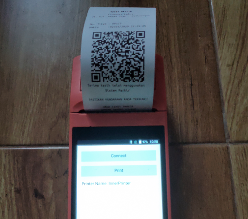

# Sunmi Bluetooth Printer

I have tested it on sunmi V1,but cutting paper command doesn't work for me.

# Support 
- Bold/Unbold
- Alignment: Left, Center, Right
- Print Text
- Print QRCode 
- Next Line
- SetDefaultLineSpace, SetLineSpace, UnderlineWithOneDotWidthOn, UnderlineWithTwoDotWidthOn, UnderlineOff (not tested)

# Demo

